# `js/` Important Design Notes

Welcome to the `js/` directory! **_Please treate it like a zen garden._** 🪷🧘‍♀️⛩️🏵🌿

## ℹ️ Main Program Flow

### 1️⃣ Design of `SemanticSteve` class

- ❗`SemanticSteve.run()` executes "parallel" (asynchronously) to 2️⃣ skill execution, hence the short asynchronous sleep 😴 to free the event loop.

```mermaid
sequenceDiagram
    participant Python as Python ZMQ Socket
    participant SS as SS Socket
    participant SS as SemanticSteve
    participant SP as SelfPreserver
    participant Skill as Skill(s)

    Note over SS: constructor()

    SS->>SS: Create bot (which has envState & thingFactory)
    SS->>SP: Initialize self-preserver w/ bot
    SS->>Skill: Initialize skills w/ bot & SemanticSteve.handleSkillResolution

    Note over SS: run()

    SS->>Python: Send initial environment state

    loop Continuous Loop
        SS->>Python: Check for skill invocation (don't await one)

        alt If skill invocation popped from ZMQ queue
            SS->>SS: Parse skillInvocation

            SS->>Skill: invoke(...args) ⚡
            Note over SS: currentSkill = skill
        end

        Note over SS: Short sleep 😴 (non-blocking) to allow invoked skills to run
        SS->>SP: shouldSelfPreserve()

        alt If self-preservation is needed
            alt If currentSkill
                SS->>Skill: pause() ⏸️
            end

            SS->>SP: await invoke()
            SP-->>SS: Self-preservation result

            alt If currentSkill
                SS->>Skill: resume() ▶️
            end
        end
    end
```

### 2️⃣ Design of `Skill` sub-classes

- ❗These skills execute "parallel" (asynchronously) to 1️⃣ `SemanticSteve.run()`, so they need to make sure to block the event loop **as little as possible**.

## ℹ️ "`Thing`"

### Some nomenclature

- **Thing Type**: A type of Minecraft "thing", e.g., "plains" is a would be a **_biome type_**, "zombie" would be a **_mob type_**, "oak log" would be a **_block type_**, etc.
- **Thing**: An actual instance of Minecraft "thing" in the game, e.g., a specific "zombie" mob, a specific "oak log" block at a specific coordinate, etc.

### `ThingType` interface

Many SemanticSteve skills take "things" to act upon, react to, etc.

Of course, there are a lot of possible types of "things" in single-player Minecraft (blocks, mobs, item entities, structures, etc).

To cleanly decouple skills from needing to know about the unique quirks of different "thing" types (allowing us to continually add support for new types of things without needing to modify skill code), we rely on a `ThingType` interface.

This `ThingType` interface should expose a/the method(s) that all implementation ought to have. For example, all `ThingType` implementations might expose an `isInSurroundings()` method so that, e.g.: the `pathfindToCoordinates` skill can use it check for `stopIfFound` things.

### `ThingType` factory

Furthermore, to prevent skills from needing to know how convert an array of strings to an array of `ThingType`s, the `thingTypeFactory` exists to decide which `ThingType` any given string should be converted to.
